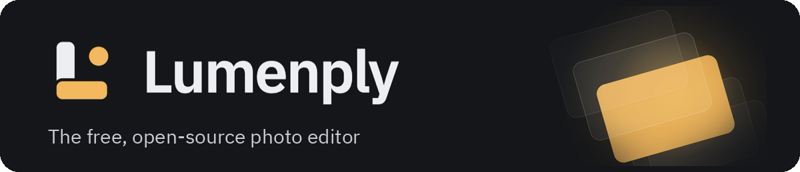
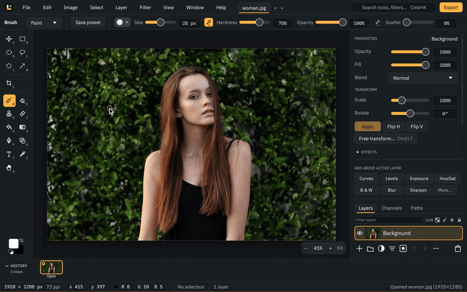

<p align="center">
  
</p>

<p align="center">
  <b>The free, open-source photo editor that feels like Photoshop.</b><br>
  Non-destructive layers, PSD import and export, on-device AI selection and background removal.<br>
  Written in Rust. No account, no subscription, no cloud.
</p>

<p align="center">
  <a href="LICENSE"></a>
  
  
  
</p>

<p align="center">
  
  <br>
  <sub>A real, unedited session: one click selects the subject with on-device AI, then a masked
  Black &amp; White layer, Curves, live type and the command palette.
  <a href="docs/media/lumenply-demo.mp4">Watch it in full quality (MP4)</a>.</sub>
</p>

---

**Lumenply** is a free raster image editor and **Photoshop alternative** for photographers,
designers and anyone who outgrew basic editors but doesn't want a subscription. It opens and
saves **layered PSD files**, keeps every adjustment **non-destructive**, uses the **Photoshop
keyboard shortcuts** you already know, and runs **AI Select Subject, Object Selection and
Remove Background locally on your computer**. Your photos never leave your machine.

- [Why Lumenply](#why-lumenply)
- [Features](#features)
- [Get Lumenply](#get-lumenply)
- [Coming from Photoshop or GIMP](#coming-from-photoshop-or-gimp)
- [FAQ](#faq)
- [How it's built](#how-its-built)
- [Contributing](#contributing) · [License](#license)

## Why Lumenply

| | |
| --- | --- |
| **Photoshop-familiar** | Same tools, menus, panels and shortcuts (V, B, M, Cmd+T, Cmd+J, Alt-click…), so there is nothing new to learn. |
| **Non-destructive by default** | Adjustment layers, live filter layers, smart objects with smart filters, layer masks and layer styles. Change anything later. |
| **Works with Photoshop files** | Opens PSD and PSB with layers, groups, masks, adjustment layers, layer styles and editable text; saves layered PSDs back. Fidelity is measured against ~480 real Photoshop files. |
| **Private, on-device AI** | Select Subject, Object Selection (click or box) and Remove Background run through ONNX Runtime on your own CPU or GPU. Models download once, on first use. |
| **Fast** | A tiled, cached render graph: undo on a 6000 × 4000 document with 30 layers takes about 10 ms. |
| **Free and open source** | GPL-3.0-or-later. No account, no telemetry, no subscription. |

## Features

### Layers and non-destructive editing
- Pixel, group (normal and pass-through), adjustment, fill (solid, gradient, pattern), shape,
  text and smart object layers
- **Layer masks** and vector masks, clipping masks, locks, fill opacity
- **All 27 Photoshop blend modes**
- **Layer styles**: drop shadow, inner shadow, outer and inner glow, bevel and emboss, colour,
  gradient and pattern overlay, stroke
- **Smart objects** with **smart filters**: transform repeatedly without losing quality, edit
  the contents in a tab, replace contents

### Adjustments and colour
- **Adjustment layers**: Levels, Curves (per channel), Brightness/Contrast, Hue/Saturation with
  Colorize, Color Balance, Black & White, Exposure, Vibrance, Photo Filter, Channel Mixer,
  Selective Color, Gradient Map, **Color Lookup (3D LUTs, .cube / .3dl)**, Invert, Posterize,
  Threshold
- Image ▸ Adjustments on pixels, plus Shadows/Highlights, Replace Color, Match Color, Equalize,
  Desaturate, Auto Tone, Auto Contrast and Auto Color
- **Camera Raw Filter**, and opening **camera RAW** files
- CMYK soft-proofing (Proof Colors, Gamut Warning), ICC profiles on import

### Selections and AI
- **AI Select Subject**, **AI Object Selection** (click, Shift-click to add, Alt-click to
  subtract, or drag a box) and **AI background removal** as a layer mask, all offline
- Marquees, lasso and polygonal lasso, Magic Wand, Quick Selection, Colour Range
- **Select and Mask** (refine edge brush, decontaminate colours), Quick Mask, feather,
  expand/contract/border/smooth, saved selections as alpha channels

### Painting and retouching
- Brush engine with sampled tips, shape dynamics, pen pressure and **Photoshop .abr brush import**
- **Spot Healing (content-aware)**, Healing Brush, Patch, Content-Aware Move, Red Eye, Clone
  Stamp, History Brush
- Dodge, Burn, Sponge, Smudge, Blur, Sharpen; Background and Magic Eraser; Paint Bucket;
  multi-stop gradients in five styles

### Transform, warp and fill
- **Free Transform** (scale, rotate, skew, perspective, warp), Puppet Warp, **Liquify**
- **Content-Aware Fill**, **Content-Aware Scale**, Crop and Perspective Crop with straighten
- Rulers, guides, grid and Smart Guides with snapping

### Text and shapes
- Editable **text layers**: click to type or draw a paragraph box, any installed font, styles per
  character, alignment, tracking and leading; Photoshop text stays editable through PSD
- Shape layers (rectangle, rounded rectangle, ellipse, polygon, line and custom shapes such as stars) and the **Pen tool**
  with a Paths panel

### Files and automation
- **Formats**: PSD/PSB, OpenRaster (.ora), PNG, JPEG, WebP, TIFF (16-bit), EXR (HDR), GIF, BMP,
  TGA, HEIC/AVIF (macOS), camera RAW; export to PNG, JPEG, WebP, GIF, PDF and 3D LUTs
- **Export As** with format, size, quality, preview and file size
- **Actions**: record edits and play them back on other images, as one undo step
- **Batch processing** from the command line: `lumenply batch` converts whole folders and can run
  an action on every file
- `.lumen` projects (a graph of edits plus content-addressed pixels), **autosave** of every open
  document and **crash recovery**

### Everyday comfort
- **Command palette** (Cmd/Ctrl+K) that finds any of 200+ commands by the word you'd use
- Tabs, Navigator, Info, Histogram, Channels and History panels with snapshots
- Customisable keyboard shortcuts, print sizes in px, %, in, cm and mm
- Screen-reader names on every control (VoiceOver, Narrator, Orca)

More screenshots are in [docs/screenshots](docs/screenshots).

## Get Lumenply

Lumenply is in **public beta (0.9.0)**. Prebuilt downloads arrive with 1.0; until then it
builds from source with one command.

1. Install Rust 1.85 or newer from [rustup.rs](https://rustup.rs). On Linux, also install
   `libxkbcommon-dev libgl-dev libx11-dev`.
2. Clone and run:

```sh
git clone https://github.com/jmsmediagroup/lumenply.git
cd lumenply
cargo run --release -p lumenply-app -- --demo        # opens the editor with a demo photo
cargo run --release -p lumenply-app -- photo.psd     # or open your own PSD, image or .lumen
```

On macOS, `scripts/bundle-macos.sh` builds `Lumenply.app` with its icon and file types.

**Platforms:** developed and tested on macOS (Apple Silicon). The same code builds for Windows
and Linux; testing there is under way ([ROADMAP.md](ROADMAP.md)). AI runs on CoreML (macOS),
DirectML (Windows), CUDA (NVIDIA) or the CPU, chosen automatically.

### Command line

The `lumenply` CLI renders projects, converts PSDs and batch-processes folders without a window:

```sh
cargo build --release -p lumenply-cli
./target/release/lumenply batch --format webp --resize 2048 --out web photos/*.jpg
./target/release/lumenply ai download birefnet-lite              # once
./target/release/lumenply ai remove-bg portrait.jpg -o cut.png   # AI cut-out
./target/release/lumenply render poster.lumen -o poster.png
./target/release/lumenply export-psd poster.lumen -o poster.psd
./target/release/lumenply --help
```

## Coming from Photoshop or GIMP

- **Photoshop users**: the tools, menus and shortcuts are where you expect them: V Move,
  M Marquee, L Lasso, W Magic Wand, B Brush, J Healing, S Clone, T Type, Cmd+T Free
  Transform, Cmd+J Layer via Copy, Cmd+G Group, Alt+Cmd+G Clipping Mask, Shift+Cmd+I Invert,
  Cmd+L Levels, Cmd+M Curves. Open your PSDs and keep working; save PSDs back for clients.
- **GIMP users**: Lumenply keeps everything editable: adjustment layers, live filters,
  smart objects and masks instead of destructive steps, with one Photoshop-style workspace.
  It reads OpenRaster files from GIMP and Krita.

## FAQ

**Is Lumenply really free?**
Yes. It is open source under GPL-3.0-or-later, with no account, subscription, ads or telemetry.

**Can Lumenply open and edit Photoshop PSD files?**
Yes: PSD and PSB in every colour mode and bit depth, with layers, groups, masks, adjustment
layers, layer styles, patterns and editable text. It saves layered PSDs too. The
reader is checked against about 480 real Photoshop files, comparing each with the composite
Photoshop stored inside it.

**Does the AI need the internet or send my photos anywhere?**
No. The models (MobileSAM for selections, BiRefNet for background removal) download once, on
first use, after you agree, and then run entirely on your computer.

**Is Lumenply a GIMP alternative?**
For photo editing, retouching and compositing, yes. It's built around non-destructive editing
and Photoshop's way of working.

**Does it support pen tablets?**
Yes. Pen pressure can drive brush size and opacity on macOS and Windows; Linux support is
planned.

**How is it tested?**
1,188 automated tests, plus 135 recorded user sessions that drive the real app with mouse and
keyboard through every area and check the result
([docs/testing](docs/testing/user-journeys.md)).

## How it's built

Lumenply is written in **Rust**. The document is a **graph of edits** (JSON nodes plus
content-addressed pixel blobs): rendering walks the graph with a per-node tile cache keyed by
content hash, so an edit recomputes only what lies downstream of it, and undo is graph history.

```
crates/
  tiles/   sparse copy-on-write 256×256 tiles, compact 16-bit storage
  doc/     document model: layers, masks, selections, adjustments, filters
  render/  CPU reference compositor, blend modes, filters, text, wgpu compositor
  graph/   the document as a graph of operations: cached tile evaluation, history, GPU executor
  io/      PSD, OpenRaster, .lumen projects, PNG/JPEG/TIFF/EXR/WebP/RAW
  ai/      on-device selection and matting with ONNX Runtime (MobileSAM, BiRefNet)
  core/    the editor: every edit is a Command with undo and redo
  cli/     the `lumenply` command-line tool
  app/     the `lumenply-app` desktop editor (egui)
```

Pixels are premultiplied, linear-light `f32` while editing and rest as 16-bit tiles. The
design decisions are recorded in [docs/adr](docs/adr); [ROADMAP.md](ROADMAP.md) lists what is
done and what is next.

## Contributing

Issues and pull requests are welcome. Read [CONTRIBUTING.md](CONTRIBUTING.md) first: every
edit is a `Command` with a test, and `cargo fmt`, `cargo clippy -- -D warnings` and
`cargo test --workspace` must pass.

## License

[GPL-3.0-or-later](LICENSE). The demo photos are CC0 (credits in
[crates/app/assets/NOTICE.md](crates/app/assets/NOTICE.md) and
[docs/media/NOTICE.md](docs/media/NOTICE.md)); the bundled fonts are DejaVu Sans (Bitstream
Vera licence) and IBM Plex (SIL Open Font License).
