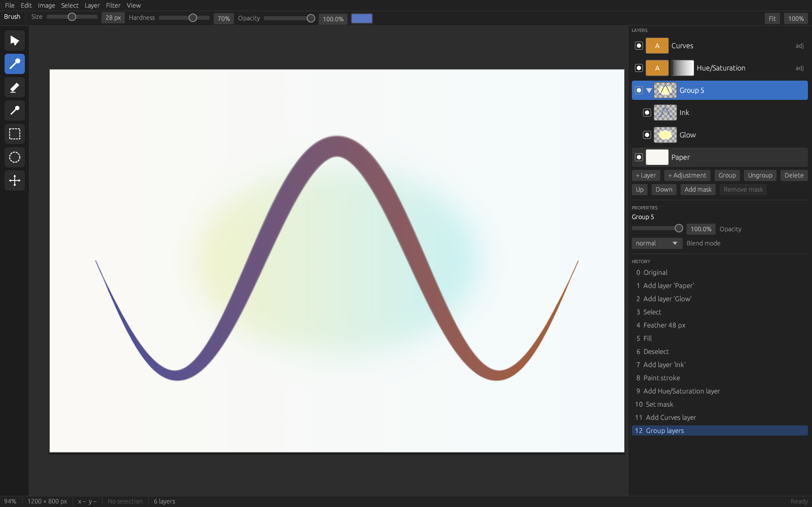

# NGE — next-gen open image editor

> **Working name.** "NGE" is a placeholder until a real name clears a trademark search.

A free, open-source raster editor that aims to feel as familiar as Photoshop,
run faster than GIMP, and work the same on desktop and in the browser.
Non-destructive by default, GPU-composited, with reliable PSD round-trip and
local AI tools.

**Status: Phase 1 → 2.** The engine composites, paints, selects, transforms,
filters, saves and reloads documents; the desktop shell (`nge-app`, egui)
exposes it: canvas with zoom and pan, brush and eraser, clone stamp, paint
bucket, gradient, eyedropper, move tool and on-canvas free transform, marquee and
magic-wand selections with feather, layer
groups with thumbnails, layer masks painted directly, eleven adjustment
layer types with live controls, blur/sharpen filters with live preview,
live filter layers, editable text layers, crop and canvas/image resize, image import
(PNG/JPEG/PSD), PNG/JPEG/PSD export, and a clickable history with redo steps.
Non-destructive editing (adjustment layers, masks) is in the core model from
the start. GPU rendering and pen input are not in yet.



More screenshots in `docs/screenshots/`.

## Layout

```
crates/
  tiles/    sparse copy-on-write 256×256 tile storage, Rect/Raster helpers
  doc/      document model: layer tree, groups, adjustment layers, masks, selections, blend modes
  render/   tiled compositor (CPU reference path; wgpu path to follow)
  io/       PNG/JPEG load + save, sRGB ⇄ linear, native .nge project format
  core/     command bus, snapshot undo/redo, editing commands, brush
  cli/      `nge` headless front end: composite, paint, render, info, bench
  app/      `nge-app` desktop shell (egui): the thin UI over `core::Editor`
```

Dependency direction is strictly downward: `cli → core → render → doc → tiles`,
with `io` beside `doc`. Nothing below `cli` knows about a window, which is
what will let the same engine power the desktop app, the browser build and
batch scripts.

### Design decisions already baked in

- **Every edit is a `Command`.** Tools, scripts and plugins all go through
  `Editor::execute`, so undo, macros and headless use share one path.
- **Undo is a document snapshot.** Documents clone cheaply because tiles are
  `Arc`-shared and copied on write; an undo step costs only the tiles touched.
- **Pixels are linear-light, premultiplied; math in `f32`, storage in 16-bit.**
  Blend math is exact and matches the W3C compositing spec. Tiles rest as
  16-bit (8 bytes/pixel, lossless for 8-bit sources) and expand to f32 only
  while a command edits them, so layer memory is half what f32 would cost.
- **Output is sparse.** The compositor only produces tiles that something
  touches.
- **Adjustment layers edit the backdrop in place.** They never accumulate
  alpha, and opacity, blend mode and mask all modulate how much of the
  adjusted colour is mixed in.
- **Masks are sparse too.** Pixels with no mask tile take the mask's default,
  so "reveal all" and "hide all" cost nothing.
- **The project file is a zip.** `manifest.json` plus one entry per allocated
  tile; mostly empty layers are nearly free, and the format is inspectable
  with any zip tool.
- **Selections are coverage masks.** Same sparse storage as layer masks, so
  "select all" is free, and a selection becomes a mask with no conversion.
- **Per-channel adjustments compile to LUTs.** Levels and Curves build a
  1024-entry table once per tile, then cost one interpolated lookup per
  channel.

## Build and run

Rust 1.85 or newer (the egui shell needs it; the engine crates alone build on 1.75).

```sh
cargo test --workspace                      # all crates
cargo run -p nge-app -- --demo              # open the demo document in the editor
cargo run -p nge-app -- my-file.nge         # open a project
cargo run -p nge-app -- photo.jpg --place logo.png   # open an image, place another as a layer
cargo build --release
./target/release/nge paint -o demo.png --save demo.nge   # brush + masked adjustment layer
./target/release/nge info demo.nge                        # print the layer tree
./target/release/nge render demo.nge -o out.png
./target/release/nge export-psd demo.nge -o demo.psd      # layered Photoshop file
./target/release/nge info file.psd                        # inspect a PSD's layer tree
./target/release/nge composite -o out.png --layer photo.jpg --layer grain.png:overlay:0.4
./target/release/nge bench --size 4096 --layers 12               # prints layer memory too
./target/release/nge blends
```

## Roadmap

See the project overview document for the full plan. Next up in Phase 0/1:

- [ ] wgpu window with GPU tile canvas, pan and zoom (spike 1)
- [ ] pen pressure and tilt via octotablet on Windows, macOS and Linux (spike 2)
- [x] layer masks and adjustment layers in `doc` (Invert, Brightness/Contrast, Hue/Saturation)
- [x] native project file format (zip container, JSON manifest, compressed tiles)
- [x] Levels, Curves (monotone cubic) and Black & White adjustments, LUT-compiled
- [x] selections: rect, ellipse, boolean ops, invert, feather; fill, clear, mask-from-selection; brush clips to selection
- [ ] transforms (move, scale, rotate) with resampling
- [ ] Color Balance, Vibrance, Gradient Map adjustments
- [ ] 8-bit and 16-bit tile storage formats
- [ ] WGSL port of the blend modes, CPU path kept as reference
- [x] egui shell around the `Editor` (brush, marquee, layers, properties, curves, history)
- [ ] docking panels (egui_dock), layer reordering by drag
- [x] live (non-destructive) filter layers: Gaussian blur, box blur, sharpen; composited per tile with a padded neighbourhood, edge-clamped
- [x] paint bucket, magic wand (tolerance, contiguous, sample-all-layers) and gradient tool (linear/radial, to-transparent)
- [x] lasso and polygonal lasso selections (antialiased scanline fill); Catmull-Rom stroke smoothing
- [x] text layers: editable text, size, bold, colour; bundled DejaVu Sans via fontdue; Move keeps them editable; Rasterize converts to pixels
- [x] 16-bit compact tile storage (halves layer memory; the 4K benchmark that used to crash now runs)
- [x] clone stamp (pick source by click or Alt+click; samples one layer or all); image rotate 90°/180° and flip, pixel-exact
- [ ] 8-bit storage mode, float/HDR mode, wgpu renderer, pen pressure (needs hardware)
- [x] PSD import/export (8-bit RGB: layers, groups, masks, opacity, blend modes, Unicode names), writer validated with psd-tools
- [x] adjustment layers through PSD both ways: Levels, Curves, Brightness/Contrast, Hue/Saturation, Color Balance, Threshold, Posterize, Invert
- [ ] PSD: 16-bit, PSB, Black & White / Exposure / Vibrance descriptors
- [ ] verify keyboard shortcuts and pen pressure on a real desktop (not testable in the headless CI box)
- [ ] CI performance gate: 50 MP, 20-layer composite under a fixed budget

## License

GPL-3.0-or-later. Contributions require signing the CLA (see CONTRIBUTING.md)
so the project keeps the option of dual licensing and app-store builds.
